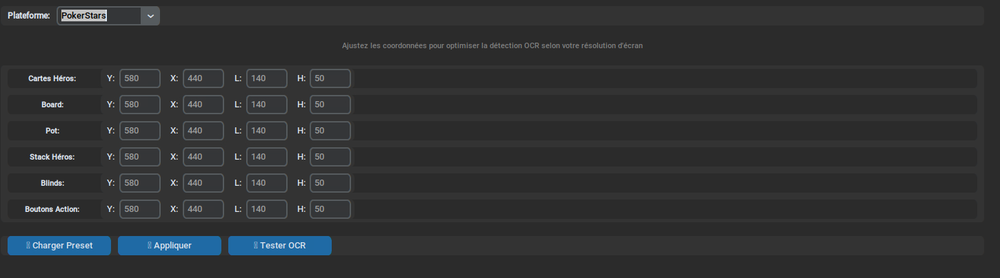

# 🔍 Guide de Calibrage OCR - RTPA Studio

Le système de calibrage OCR permet d'ajuster précisément la détection des éléments de jeu selon votre résolution d'écran et votre plateforme poker.

## 📍 Accès au Calibrage

1. **Lancez RTPA Studio** avec `python rtpa.py`
2. **Cliquez sur l'onglet "🔧 Paramètres"**
3. **Localisez la section "🔍 Calibrage OCR"**

## ⚙️ Interface de Calibrage

### 🎯 Sélection de Plateforme
- **Menu déroulant** : Choisissez votre plateforme poker
  - PokerStars
  - Winamax  
  - PMU
  - PartyPoker

### 📐 Zones Configurables

Chaque zone a 4 paramètres ajustables :

| Zone | Description | Paramètres |
|------|-------------|------------|
| **Cartes Héros** | Position de vos 2 cartes | Y, X, L, H |
| **Board** | Cartes communes (flop/turn/river) | Y, X, L, H |
| **Pot** | Montant du pot | Y, X, L, H |
| **Stack Héros** | Votre pile de jetons | Y, X, L, H |
| **Blinds** | Petite et grosse blinde | Y, X, L, H |
| **Boutons Action** | Zone Fold/Call/Raise | Y, X, L, H |

**Paramètres des coordonnées :**
- **Y** : Position verticale (pixels depuis le haut)
- **X** : Position horizontale (pixels depuis la gauche)
- **L** : Largeur de la zone de détection
- **H** : Hauteur de la zone de détection

## 🛠️ Boutons de Contrôle

### 📋 Charger Preset
- **Fonction** : Charge les coordonnées par défaut pour votre plateforme
- **Usage** : Cliquez pour remplir automatiquement tous les champs
- **Conseil** : Utilisez ceci comme point de départ avant ajustements

### 🤖 Auto-Calibrage
- **Fonction** : Détection automatique et application des réglages
- **Intelligence** : Détecte votre plateforme active et applique le bon preset
- **Rapidité** : Calibrage en un clic sans intervention manuelle
- **Surveillance continue** : Détection automatique des nouvelles plateformes
- **Multiplateforme** : Support PokerStars, Winamax, PMU, PartyPoker

### ✅ Appliquer
- **Fonction** : Sauvegarde vos réglages personnalisés
- **Sauvegarde** : Crée le fichier `config/ocr_calibration.json`
- **Persistance** : Vos réglages sont rechargés au prochain démarrage

### 🔍 Tester OCR
- **Fonction** : Vérifie que la détection fonctionne
- **Feedback** : Affiche les résultats dans la console et l'interface
- **Validation** : Confirme que vos zones sont bien configurées
- **Détection temps réel** : Capture et analyse l'état actuel du jeu

## 🎯 Guide d'Utilisation Étape par Étape

### Méthode Rapide (Recommandée)
1. **Sélectionnez votre plateforme** dans le menu déroulant
2. **Cliquez "🤖 Auto-Calibrage"**
3. **Cliquez "🔍 Tester OCR"** pour vérifier
4. ✅ **Terminé !**

### Méthode Manuelle (Ajustements Précis)
1. **Sélectionnez votre plateforme**
2. **Cliquez "📋 Charger Preset"**
3. **Ajustez les coordonnées** selon vos besoins :
   - Modifiez Y/X pour déplacer la zone
   - Ajustez L/H pour redimensionner
4. **Cliquez "✅ Appliquer"** pour sauvegarder
5. **Cliquez "🔍 Tester OCR"** pour valider

## 🔧 Résolution de Problèmes

### Détection Imprécise
- **Vérifiez** que votre plateforme est correctement sélectionnée
- **Ajustez** les coordonnées Y/X si les zones sont décalées
- **Redimensionnez** L/H si la zone est trop petite/grande

### Aucune Détection
- **Assurez-vous** que votre plateforme poker est ouverte
- **Vérifiez** que la table de jeu est visible à l'écran
- **Testez** avec "🔍 Tester OCR" pour diagnostiquer

### Coordonnées Incorrectes
- **Utilisez** "📋 Charger Preset" pour revenir aux valeurs par défaut
- **Essayez** "🤖 Auto-Calibrage" pour une détection automatique
- **Ajustez** manuellement selon votre résolution d'écran

## 💾 Sauvegarde et Restauration

### Sauvegarde Automatique
- **Fichier** : `config/ocr_calibration.json`
- **Contenu** : Toutes vos coordonnées personnalisées
- **Chargement** : Automatique au démarrage de RTPA Studio

### Réinitialisation
- **Supprimez** le fichier `config/ocr_calibration.json`
- **Redémarrez** RTPA Studio
- **Rechargez** les presets par défaut

## 🎮 Plateformes Supportées

### PokerStars
- **Résolution testée** : 1920x1080, 1366x768, 2560x1440
- **Zones optimisées** : Table standard PokerStars
- **Détection automatique** : Processus PokerStars.exe
- **Particularités** : Interface classique avec thèmes sombre/clair

### Winamax
- **Résolution testée** : 1920x1080, 1366x768, 2560x1440
- **Zones optimisées** : Interface web/logiciel
- **Détection automatique** : Processus Winamax.exe, navigateurs (Firefox, Chrome)
- **Particularités** : Interface moderne avec animations

### PMU Poker
- **Résolution testée** : 1920x1080, 1366x768
- **Zones optimisées** : Interface PMU spécifique
- **Détection automatique** : Processus PMUPoker.exe
- **Particularités** : Layout et couleurs distinctifs

### PartyPoker
- **Résolution testée** : 1920x1080
- **Zones optimisées** : Interface PartyPoker
- **Détection automatique** : Processus PartyPoker.exe
- **Particularités** : Boutons d'action et design spécifiques

## ⚡ Conseils d'Optimisation

### Pour de Meilleures Performances
- **Utilisez** une résolution d'écran stable
- **Placez** votre table poker au même endroit
- **Évitez** de redimensionner la fenêtre poker
- **Calibrez** une seule fois par plateforme

### Ajustements Fins
- **Commencez** toujours par "📋 Charger Preset"
- **Ajustez** par petits incréments (+/- 5-10 pixels)
- **Testez** après chaque modification
- **Sauvegardez** dès que c'est optimal

---

**🚀 Le calibrage OCR assure une détection précise et fiable pour des recommandations optimales !**